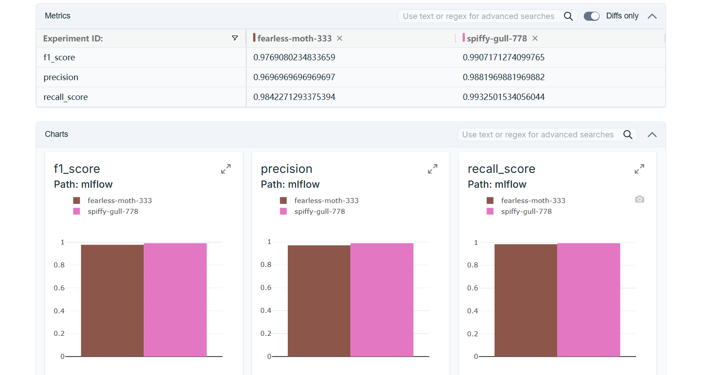
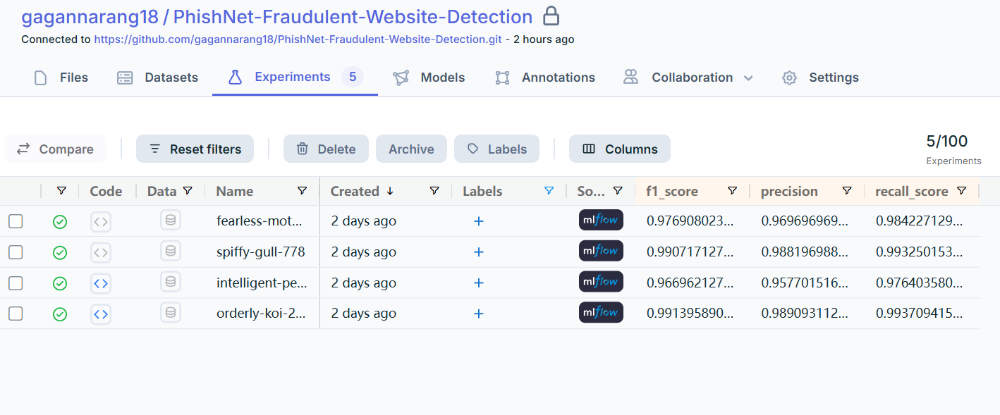

## 📌 Project Overview  
PhishNet is an **end-to-end MLOps pipeline** for detecting fraudulent websites with high accuracy.  
It automates **data ingestion, validation, transformation, model training, experiment tracking, and deployment** into a real-time API.  

- ✅ **99.2% validation accuracy** and **0.97 F1-score**  
- ✅ Full **MLflow + DagsHub** integration for experiment tracking and model versioning  
- ✅ Models and artifacts automatically synced to **AWS S3** for reproducibility  
- ✅ Deployed as a containerized **FastAPI service** on **AWS EC2/ECR**  

---

## ⚙️ Tech Stack  
- **Python, scikit-learn, Pandas, NumPy**  
- **MLflow, DagsHub** (for tracking & versioning)  
- **AWS EC2, ECR, S3, Docker** (for deployment)  
- **MongoDB** (for metadata storage)  
- **FastAPI** (for serving the model)  

---

## 📊 Experiments & Results  

Tracked using **MLflow + DagsHub**:  

| Run Name           | F1 Score | Precision | Recall |
|--------------------|----------|-----------|--------|
| fearless-moth-333  | 0.9769   | 0.9697    | 0.9842 |
| spiffy-gull-778    | 0.9907   | 0.9882    | 0.9932 |
| intelligent-penguin| 0.9669   | 0.9577    | 0.9764 |
| orderly-koi-222    | 0.9914   | 0.9890    | 0.9937 |

## 📊 Experiment Tracking  

We used **MLflow with DagsHub integration** for tracking metrics, parameters, and model versions.  

  
*Comparison of multiple models (Random Forest, Gradient Boosting, AdaBoost, etc.) with hyperparameter tuning.*  

  
*Registered models and versioning for reproducibility and deployment rollbacks.*  
---

## 🏗️ Project Architecture  

```mermaid
flowchart TD
    A[Data Ingestion] --> B[Data Validation]
    B --> C[Data Transformation]
    C --> D[Model Training + Hyperparameter Tuning]
    D --> E[MLflow & DagsHub Tracking]
    E --> F[Artifacts + Models Synced to AWS S3]
    F --> G[FastAPI Model Deployment in Docker]
    G --> H[AWS EC2/ECR Hosting]
    H --> I[MongoDB Metadata Logging + Monitoring]


   ## 🔧 Setup & Run  

Follow these steps to set up and run the project locally or on a server:  

1️⃣ **Clone Repository**  
git clone https://github.com/gagannarang18/PhishNet-Fraudulent-Website-Detection.git  
cd PhishNet-Fraudulent-Website-Detection  

2️⃣ **Create Virtual Environment (Optional but Recommended)**  
python -m venv venv  
venv\Scripts\activate      # On Windows  
source venv/bin/activate   # On Linux/Mac  

3️⃣ **Install Requirements**  
pip install --upgrade pip  
pip install -r requirements.txt  

4️⃣ **Configure Environment Variables**  
Create a `.env` file in the **root directory** and add your credentials:  
MONGO_DB_URL=your_mongodb_connection_string  
DAGSHUB_TOKEN=your_dagshub_token  
AWS_ACCESS_KEY_ID=your_aws_key  
AWS_SECRET_ACCESS_KEY=your_aws_secret  

5️⃣ **Run Training Pipeline (Optional)**  
If you want to retrain the model:  
python main.py  

6️⃣ **Run FastAPI App**  
Start the inference API:  
python app.py  

Now open your browser at **http://localhost:8000/docs** to test the API endpoints. 🚀  
